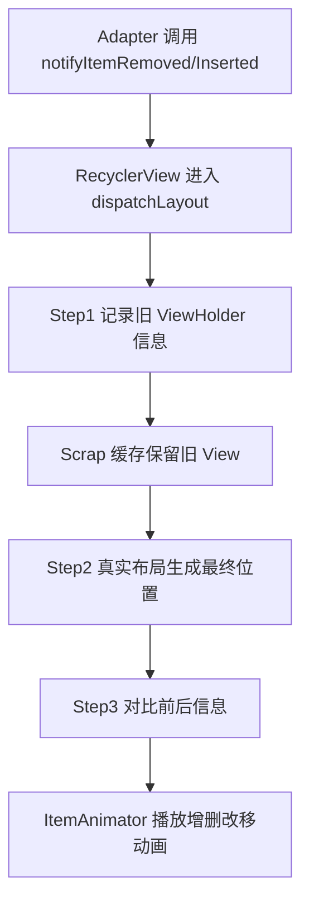

## 前言

`RecyclerView` 是 Android 里最常用的列表组件之一。它的核心价值不只是“展示一组数据”，而是用更高效的方式管理大数据集、复杂布局、局部刷新、滑动交互和 Item 动画。

这篇文章会从最基础的使用开始，逐步整理到左滑删除、自定义左滑操作栏、动画执行流程，以及 RecyclerView 缓存机制和动画之间的关系。读完之后，你应该能更清楚地知道：为什么推荐使用局部刷新，为什么动画依赖旧的 `ViewHolder`，以及为什么缓存复用是 RecyclerView 流畅体验的基础。

## 基础使用

RecyclerView 的基础使用通常分为三步：

1. 在 XML 中声明 RecyclerView 和列表 item。
2. 编写数据模型、`ViewHolder` 和 `Adapter`。
3. 在 Activity 或 Fragment 中设置 `LayoutManager` 和 `Adapter`。

### 创建布局文件

先在页面布局中放一个 `RecyclerView`：

```xml title="activity_main.xml"
<androidx.recyclerview.widget.RecyclerView
    android:id="@+id/recyclerView"
    android:layout_width="match_parent"
    android:layout_height="match_parent" />
```

再创建一个列表 item 布局：

```xml title="item_user.xml"
<LinearLayout xmlns:android="http://schemas.android.com/apk/res/android"
    android:layout_width="match_parent"
    android:layout_height="wrap_content">

    <TextView
        android:id="@+id/tvName"
        android:layout_width="wrap_content"
        android:layout_height="50dp" />
</LinearLayout>
```

### 创建 ViewHolder 和 Adapter

`ViewHolder` 用来缓存 item 内部的 View 引用，`Adapter` 负责创建 item、绑定数据，以及告诉 RecyclerView 当前有多少条数据。

```kotlin title="UserAdapter.kt" showLineNumbers
data class User(val name: String, val age: Int)

class UserViewHolder(itemView: View) : RecyclerView.ViewHolder(itemView) {
    val tvName: TextView = itemView.findViewById(R.id.tvName)
}

class UserAdapter(private val users: List<User>) :
    RecyclerView.Adapter<UserViewHolder>() {

    override fun onCreateViewHolder(parent: ViewGroup, viewType: Int): UserViewHolder {
        val view = LayoutInflater.from(parent.context)
            .inflate(R.layout.item_user, parent, false)
        return UserViewHolder(view)
    }

    override fun onBindViewHolder(holder: UserViewHolder, position: Int) {
        val user = users[position]
        holder.tvName.text = "${user.name} (${user.age})"
    }

    override fun getItemCount(): Int = users.size
}
```

### 在 Activity 中绑定列表

```kotlin title="MainActivity.kt" {3-11}
val recyclerView: RecyclerView = findViewById(R.id.recyclerView)

recyclerView.layoutManager = LinearLayoutManager(this)
recyclerView.adapter = UserAdapter(
    listOf(
        User("Alice", 25),
        User("Bob", 30),
        User("Charlie", 28),
    )
)
recyclerView.setHasFixedSize(true)
```

`setHasFixedSize(true)` 表示 RecyclerView 自身大小不会因为 item 内容变化而改变。对于普通固定高度列表，它可以减少一些不必要的布局计算。

## 常用布局管理器

RecyclerView 本身不关心 item 应该怎样排列，排列方式交给 `LayoutManager` 负责。常用的布局管理器有三类：

```kotlin title="LayoutManagerExamples.kt"
// 垂直线性列表
recyclerView.layoutManager = LinearLayoutManager(this)

// 水平线性列表
recyclerView.layoutManager = LinearLayoutManager(
    this,
    RecyclerView.HORIZONTAL,
    false,
)

// 网格布局，3 列
recyclerView.layoutManager = GridLayoutManager(this, 3)

// 瀑布流布局，2 列
recyclerView.layoutManager = StaggeredGridLayoutManager(
    2,
    StaggeredGridLayoutManager.VERTICAL,
)
```

一般来说：

- 普通列表用 `LinearLayoutManager`。
- 九宫格、图片网格用 `GridLayoutManager`。
- 高度不固定的瀑布流页面用 `StaggeredGridLayoutManager`。

## 添加分割线和间距

Android 提供了默认的分割线：

```kotlin title="Divider.kt"
recyclerView.addItemDecoration(
    DividerItemDecoration(this, DividerItemDecoration.VERTICAL)
)
```

如果只是想给每个 item 增加间距，可以自定义 `ItemDecoration`：

```kotlin title="SpaceDecoration.kt"
class SpaceDecoration(private val space: Int) : RecyclerView.ItemDecoration() {
    override fun getItemOffsets(
        outRect: Rect,
        view: View,
        parent: RecyclerView,
        state: RecyclerView.State,
    ) {
        outRect.bottom = space
    }
}

recyclerView.addItemDecoration(SpaceDecoration(16.dpToPx()))
```

`ItemDecoration` 的好处是它不侵入 item 布局，适合统一处理列表间距、分割线、分组吸顶等视觉效果。

## 左滑删除：使用 ItemTouchHelper

RecyclerView 的左滑删除可以用 `ItemTouchHelper` 快速实现。如果你的需求是“左滑后直接删除”，这种方案很合适。

```kotlin title="SwipeToDeleteCallback.kt"
class SwipeToDeleteCallback(
    private val onDelete: (position: Int) -> Unit,
) : ItemTouchHelper.SimpleCallback(0, ItemTouchHelper.LEFT) {

    override fun onMove(
        recyclerView: RecyclerView,
        viewHolder: RecyclerView.ViewHolder,
        target: RecyclerView.ViewHolder,
    ): Boolean {
        return false
    }

    override fun onSwiped(viewHolder: RecyclerView.ViewHolder, direction: Int) {
        onDelete(viewHolder.bindingAdapterPosition)
    }
}
```

绑定到 RecyclerView：

```kotlin title="BindSwipe.kt"
val callback = SwipeToDeleteCallback { position ->
    adapter.removeAt(position)
}

ItemTouchHelper(callback).attachToRecyclerView(recyclerView)
```

Adapter 中对应的删除方法要注意边界判断：

```kotlin title="MyAdapter.kt" {12-17}
class MyAdapter(private val data: MutableList<String>) :
    RecyclerView.Adapter<MyAdapter.VH>() {

    class VH(itemView: View) : RecyclerView.ViewHolder(itemView)

    override fun onCreateViewHolder(parent: ViewGroup, viewType: Int): VH {
        val view = LayoutInflater.from(parent.context)
            .inflate(R.layout.item_text, parent, false)
        return VH(view)
    }

    fun removeAt(position: Int) {
        if (position in data.indices) {
            data.removeAt(position)
            notifyItemRemoved(position)
        }
    }
}
```

> [!TIP] 建议
> 能用 `notifyItemRemoved(position)` 就不要直接用 `notifyDataSetChanged()`，因为局部刷新可以保留动画和更精确的布局变化。

## 左滑露出操作按钮

如果需求不是直接删除，而是“左滑后露出删除、收藏、更多操作按钮”，只靠 `ItemTouchHelper` 会不够自然。更推荐把 item 布局拆成两层：

- 背景操作层：放删除、收藏等按钮。
- 前景内容层：真正跟随手势移动。

```xml title="item_swipe_reveal.xml"
<FrameLayout xmlns:android="http://schemas.android.com/apk/res/android"
    android:layout_width="match_parent"
    android:layout_height="72dp">

    <LinearLayout
        android:layout_width="match_parent"
        android:layout_height="match_parent"
        android:gravity="end|center_vertical"
        android:orientation="horizontal">

        <Button
            android:id="@+id/btnDelete"
            android:layout_width="72dp"
            android:layout_height="match_parent"
            android:text="删除" />
    </LinearLayout>

    <LinearLayout
        android:id="@+id/frontView"
        android:layout_width="match_parent"
        android:layout_height="match_parent"
        android:background="@android:color/white"
        android:gravity="center_vertical"
        android:orientation="horizontal">

        <TextView
            android:id="@+id/tvTitle"
            android:layout_width="wrap_content"
            android:layout_height="wrap_content"
            android:text="Item" />
    </LinearLayout>
</FrameLayout>
```

这个方案的核心是：滑动时只移动前景内容层的 `translationX`，背景按钮保持不动，松手后根据滑动距离判断展开还是收起。

## 自定义 SwipeRevealLayout

下面是一个精简版的 `SwipeRevealLayout`。它约定第一个 child 是背景操作层，第二个 child 是前景内容层。

```kotlin title="SwipeRevealLayout.kt" showLineNumbers collapse={1-19}
class SwipeRevealLayout @JvmOverloads constructor(
    context: Context,
    attrs: AttributeSet? = null,
) : FrameLayout(context, attrs) {

    private var actionContainer: View? = null
    private var frontView: View? = null

    private var downX = 0f
    private var downY = 0f
    private var lastX = 0f
    private var isDragging = false
    private var actionWidth = 0f

    private val touchSlop = ViewConfiguration.get(context).scaledTouchSlop

    var isOpen = false
        private set

    override fun onFinishInflate() {
        super.onFinishInflate()
        actionContainer = getChildAt(0)
        frontView = getChildAt(1)

        post {
            actionWidth = actionContainer?.width?.toFloat() ?: 0f
        }
    }

    override fun onInterceptTouchEvent(ev: MotionEvent): Boolean {
        when (ev.actionMasked) {
            MotionEvent.ACTION_DOWN -> {
                downX = ev.x
                downY = ev.y
                lastX = ev.x
                isDragging = false
            }

            MotionEvent.ACTION_MOVE -> {
                val dx = ev.x - downX
                val dy = ev.y - downY

                if (abs(dx) > touchSlop && abs(dx) > abs(dy)) {
                    isDragging = true
                    parent.requestDisallowInterceptTouchEvent(true)
                    return true
                }
            }
        }
        return super.onInterceptTouchEvent(ev)
    }

    override fun onTouchEvent(event: MotionEvent): Boolean {
        when (event.actionMasked) {
            MotionEvent.ACTION_MOVE -> {
                val dx = event.x - lastX
                val current = (frontView?.translationX ?: 0f) + dx
                frontView?.translationX = current.coerceIn(-actionWidth, 0f)
                lastX = event.x
                return true
            }

            MotionEvent.ACTION_UP,
            MotionEvent.ACTION_CANCEL -> {
                val tx = frontView?.translationX ?: 0f
                if (-tx > actionWidth / 2f) {
                    open()
                } else {
                    close()
                }
                isDragging = false
                return true
            }
        }
        return super.onTouchEvent(event)
    }

    fun open() {
        frontView?.animate()
            ?.translationX(-actionWidth)
            ?.setDuration(180)
            ?.start()
        isOpen = true
    }

    fun close() {
        frontView?.animate()
            ?.translationX(0f)
            ?.setDuration(180)
            ?.start()
        isOpen = false
    }
}
```

在 Adapter 里建议只允许同时展开一个 item，否则列表滚动和复用时很容易出现多个 item 同时展开的混乱状态。

```kotlin title="SwipeAdapter.kt" {5, 17-23}
class MyAdapter(
    private val data: MutableList<String>,
) : RecyclerView.Adapter<MyAdapter.VH>() {

    private var openedPosition = RecyclerView.NO_POSITION

    class VH(itemView: View) : RecyclerView.ViewHolder(itemView) {
        val swipeLayout: SwipeRevealLayout = itemView.findViewById(R.id.swipeLayout)
        val btnDelete: Button = itemView.findViewById(R.id.btnDelete)
        val btnCollect: Button = itemView.findViewById(R.id.btnCollect)
        val tvTitle: TextView = itemView.findViewById(R.id.tvTitle)
    }

    override fun onBindViewHolder(holder: VH, position: Int) {
        holder.tvTitle.text = data[position]

        if (position == openedPosition) {
            holder.swipeLayout.post { holder.swipeLayout.open() }
        } else {
            holder.swipeLayout.post { holder.swipeLayout.close() }
        }

        holder.btnDelete.setOnClickListener {
            val pos = holder.bindingAdapterPosition
            if (pos != RecyclerView.NO_POSITION) {
                data.removeAt(pos)
                notifyItemRemoved(pos)
            }
        }
    }
}
```

## RecyclerView 动画的核心流程

RecyclerView 的布局和动画不是分开的两件事。它们都走 `dispatchLayout()`，并且分成三步：

```java title="RecyclerView.java" showLineNumbers
void dispatchLayout() {
    // Step 1：布局前，处理 adapter 更新、预布局、记录旧 item 信息
    dispatchLayoutStep1();

    // Step 2：布局中，真正把子 View 摆到最终位置
    dispatchLayoutStep2();

    // Step 3：布局后，对比前后状态并执行动画
    dispatchLayoutStep3();
}
```

可以把它理解成：

- Step 1：先记录“变化前”的样子。
- Step 2：再摆出“变化后”的样子。
- Step 3：最后比较前后差异并播放动画。

常见动画类型包括：

- `PERSISTENT`：布局前后都存在，通常做平移动画。
- `REMOVED`：布局前可见，但数据已删除。
- `ADDED`：新增数据，布局后可见。
- `DISAPPEARING`：数据仍存在，但布局后不可见。
- `APPEARING`：数据仍存在，但布局后从不可见变成可见。

## dispatchLayoutStep1：预布局与旧信息记录

第一步会处理 Adapter 更新，并在需要动画时记录当前屏幕上所有 item 的旧布局信息。

```java title="RecyclerView.java" {3-13}
private void dispatchLayoutStep1() {
    processAdapterUpdatesAndSetAnimationFlags();

    if (mState.mRunSimpleAnimations) {
        int childCount = mChildHelper.getChildCount();
        for (int i = 0; i < childCount; ++i) {
            View child = mChildHelper.getChildAt(i);
            ViewHolder holder = getChildViewHolderInt(child);
            ItemHolderInfo preInfo =
                mItemAnimator.recordPreLayoutInformation(holder);
            mViewInfoStore.addToPreLayout(holder, preInfo);
        }

        saveOldPositions();
        mLayout.onLayoutChildren(mRecycler, mState);
        clearOldPositions();
    }
}
```

这一阶段最关键的是“旧信息记录”。如果没有旧位置、旧透明度、旧边界，后面就没有办法知道该从哪里动画到哪里。

## dispatchLayoutStep2：真实布局

第二步会关闭预布局模式，并调用 `LayoutManager` 重新布局子 View。

```java title="RecyclerView.java"
private void dispatchLayoutStep2() {
    mState.mInPreLayout = false;
    mLayout.onLayoutChildren(mRecycler, mState);
}
```

从用户视角看，Step 2 决定的是最终界面长什么样；从动画视角看，它提供的是“动画结束位置”。

## dispatchLayoutStep3：动画分发

第三步会记录布局后的最终信息，并交给 `ViewInfoStore` 对比处理。

```java title="RecyclerView.java"
private void dispatchLayoutStep3() {
    if (mState.mRunSimpleAnimations) {
        int childCount = mChildHelper.getChildCount();
        for (int i = childCount - 1; i >= 0; i--) {
            ViewHolder holder = getChildViewHolderInt(mChildHelper.getChildAt(i));
            ItemHolderInfo postInfo =
                mItemAnimator.recordPostLayoutInformation(holder);
            mViewInfoStore.addToPostLayout(holder, postInfo);
        }

        mViewInfoStore.process(mViewInfoProcessCallback);
    }
}
```

`ViewInfoStore.process()` 会根据 item 的标记分发不同动画：

```java title="ViewInfoStore.java" collapse={1-6, 24-32}
void process(ProcessCallback callback) {
    for (int index = mLayoutHolderMap.size() - 1; index >= 0; index--) {
        RecyclerView.ViewHolder viewHolder = mLayoutHolderMap.keyAt(index);
        InfoRecord record = mLayoutHolderMap.removeAt(index);

        if ((record.flags & FLAG_APPEAR_AND_DISAPPEAR) == FLAG_APPEAR_AND_DISAPPEAR) {
            callback.unused(viewHolder);
        } else if ((record.flags & FLAG_DISAPPEARED) != 0) {
            callback.processDisappeared(viewHolder, record.preInfo, record.postInfo);
        } else if ((record.flags & FLAG_APPEAR_PRE_AND_POST) == FLAG_APPEAR_PRE_AND_POST) {
            callback.processAppeared(viewHolder, record.preInfo, record.postInfo);
        } else if ((record.flags & FLAG_PRE_AND_POST) == FLAG_PRE_AND_POST) {
            callback.processPersistent(viewHolder, record.preInfo, record.postInfo);
        } else if ((record.flags & FLAG_PRE) != 0) {
            callback.processDisappeared(viewHolder, record.preInfo, null);
        } else if ((record.flags & FLAG_POST) != 0) {
            callback.processAppeared(viewHolder, record.preInfo, record.postInfo);
        }

        InfoRecord.recycle(record);
    }
}
```

结合 `notifyItemRemoved()` 和 `notifyItemInserted()` 来看：

- 删除 item：Step 1 记录旧 item，Step 2 真实布局中 item 消失，Step 3 播放删除动画和其他 item 的平移动画。
- 插入 item：Step 1 通过预布局腾出空间，Step 2 把新 item 摆到屏幕上，Step 3 播放新增动画。

## 自定义 ItemAnimator

默认的 `DefaultItemAnimator` 已经提供了增删改移动画。如果要自定义删除动画，可以继承它并重写相关方法。

```kotlin title="CustomItemAnimator.kt" showLineNumbers
class CustomItemAnimator : DefaultItemAnimator() {

    private val animationDuration = 300L
    private val interpolator = AccelerateDecelerateInterpolator()

    override fun animateRemove(holder: RecyclerView.ViewHolder): Boolean {
        val view = holder.itemView
        resetAnimation(holder)

        view.animate()
            .translationX(view.width.toFloat())
            .alpha(0f)
            .setDuration(animationDuration)
            .setInterpolator(interpolator)
            .setListener(object : AnimatorListenerAdapter() {
                override fun onAnimationEnd(animation: Animator) {
                    view.translationX = 0f
                    view.alpha = 1f
                    dispatchRemoveFinished(holder)
                    dispatchAnimationFinished(holder)
                }
            })
            .start()

        return true
    }

    private fun resetAnimation(holder: RecyclerView.ViewHolder) {
        holder.itemView.animate().cancel()
        holder.itemView.alpha = 1f
        holder.itemView.translationX = 0f
        holder.itemView.translationY = 0f
    }
}
```

如果调用 `recyclerView.itemAnimator = null`，局部刷新仍然会发生，但不会播放增删改移动画。此时列表会直接变化，视觉上更生硬。

## 缓存与动画的关系

RecyclerView 的动画离不开缓存。动画要想流畅，就必须保留变化前的旧 ViewHolder；如果旧 View 被直接销毁，动画就失去了载体。

可以把缓存和动画的关系理解成下面这张流程图：



不同缓存层级对动画的影响也不同：

- `mAttachedScrap`：保存仍然 attached 的 ViewHolder，常用于预布局和移动动画。
- `mChangedScrap`：保存内容发生变化的 ViewHolder，常用于 change 动画。
- `mCachedViews`：保存刚滑出屏幕的 ViewHolder，帮助滚动时快速复用。
- `RecycledViewPool`：按 item 类型复用 ViewHolder，减少频繁创建 View。

局部更新动画依赖 Scrap 缓存，因为它需要旧 ViewHolder 作为动画素材；滚动流畅性依赖 `mCachedViews` 和 `RecycledViewPool`，因为它们能减少 `onCreateViewHolder()` 和重复布局开销。

## 为什么不建议滥用 notifyDataSetChanged

`notifyDataSetChanged()` 会告诉 RecyclerView：“整份数据都变了”。这种更新方式信息太粗，RecyclerView 很难判断具体哪个 item 被删除、插入或移动。

结果就是：

- 很多局部动画无法准确播放。
- 列表可能出现整体刷新感。
- 性能上也不如精确通知。

更推荐使用：

```kotlin title="BetterNotify.kt"
adapter.notifyItemInserted(position)
adapter.notifyItemRemoved(position)
adapter.notifyItemChanged(position)
adapter.notifyItemMoved(fromPosition, toPosition)
```

这些方法能让 RecyclerView 更准确地保留旧状态、计算新状态，并播放对应动画。

## 总结

RecyclerView 的核心不只是 Adapter 三件套，而是一整套围绕“高效复用”和“局部变化”的机制：

1. 基础展示依赖 `LayoutManager`、`Adapter` 和 `ViewHolder`。
2. 左滑删除可以用 `ItemTouchHelper` 快速实现。
3. 左滑操作栏更适合封装自定义 `SwipeRevealLayout`。
4. 动画依赖 `dispatchLayout()` 的三步流程：布局前记录、真实布局、布局后对比。
5. 缓存为动画提供旧 ViewHolder，动画让缓存复用的过程更自然。
6. 精确使用 `notifyItemInserted/Removed/Changed/Moved`，能同时提升性能和动画体验。

理解这些机制后，再看 RecyclerView 的列表刷新、左滑操作和动画效果，就不会只停留在“会用”层面，而是能知道每一步为什么这样设计。
