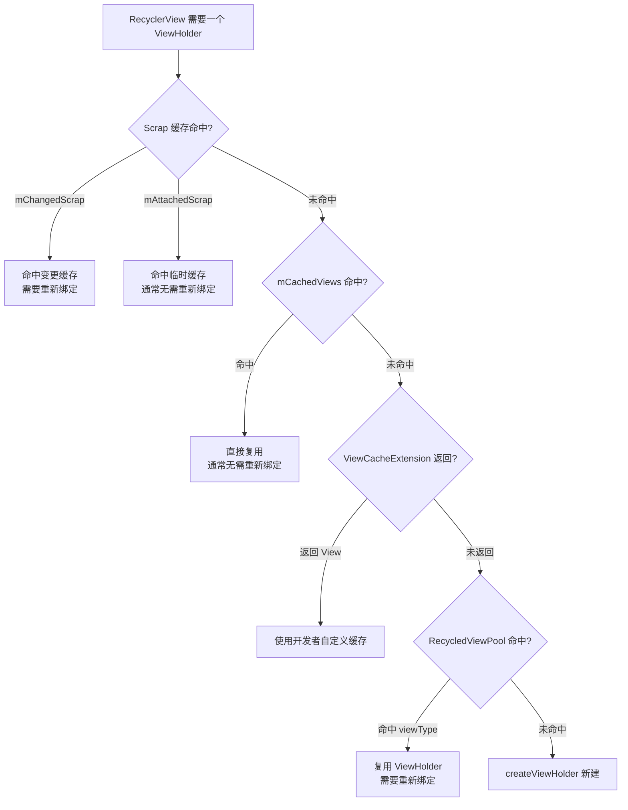
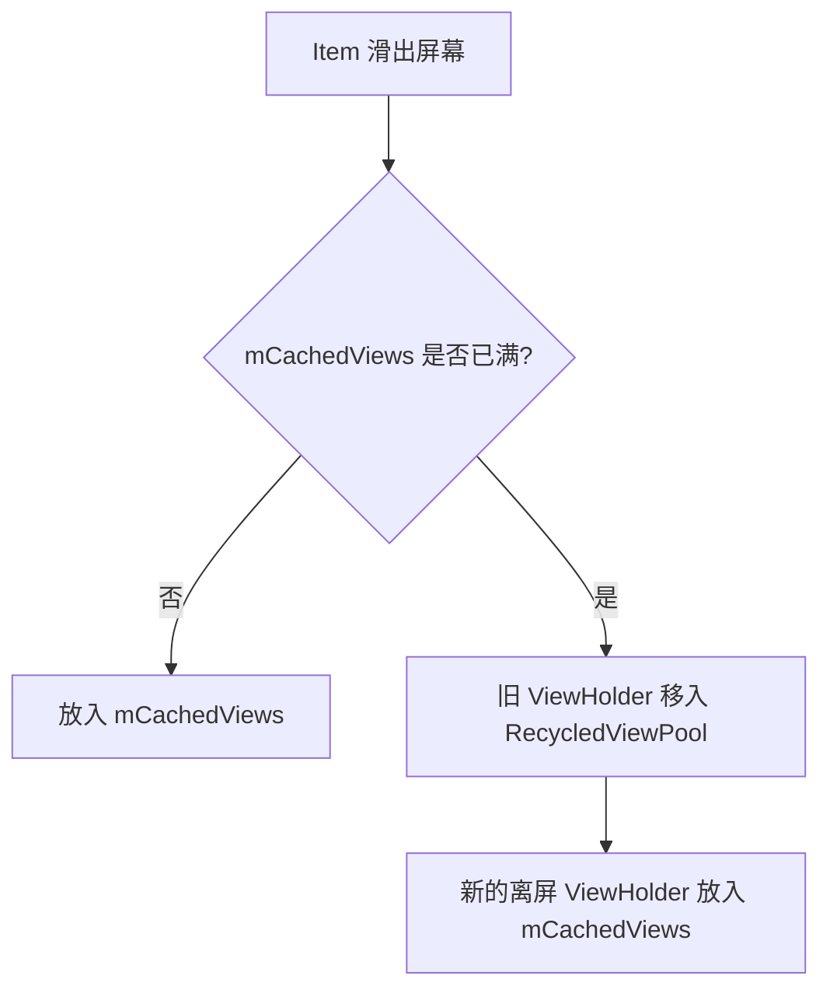
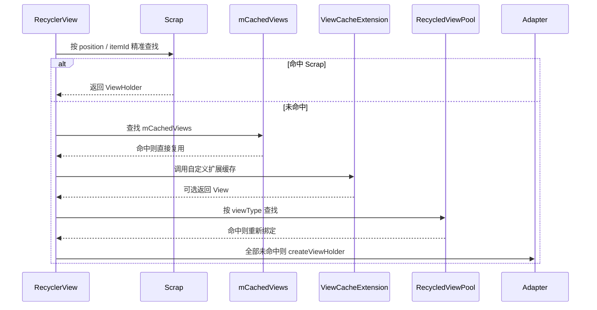

## 前言

RecyclerView 的性能核心不只在于“复用 ViewHolder”，而在于它有一套分层缓存体系。不同缓存层级负责不同场景：有的用于布局期间的临时复用，有的用于滑动时快速命中，有的允许开发者扩展，有的负责跨 RecyclerView 共享。

理解这些缓存层级之后，再看 RecyclerView 的滚动、局部刷新、动画和多列表优化，就会清楚很多：哪些缓存命中后不需要重新绑定数据，哪些缓存只复用壳子但必须重新 `onBindViewHolder()`，以及为什么滥用 `notifyDataSetChanged()` 会让列表体验变差。

这篇文章把 RecyclerView 缓存按常见四级结构整理：

1. Scrap 临时缓存：`mAttachedScrap` 和 `mChangedScrap`
2. 滑动缓存：`mCachedViews`
3. 自定义扩展缓存：`ViewCacheExtension`
4. 全局共享缓存池：`RecycledViewPool`

## 四级缓存总览

先用一张图看整体复用顺序：



可以把它们简单理解为：

| 缓存层级 | 典型成员 | 主要场景 | 是否需要重新绑定 |
| :--- | :--- | :--- | :--- |
| 一级缓存 | `mAttachedScrap` / `mChangedScrap` | 布局、局部刷新、预布局 | 视情况而定 |
| 二级缓存 | `mCachedViews` | 滑动离屏后快速复用 | 通常不需要 |
| 三级缓存 | `ViewCacheExtension` | 开发者自定义查找 | 由开发者决定 |
| 四级缓存 | `RecycledViewPool` | 按 `viewType` 复用、跨列表共享 | 需要 |

## 一级缓存：Scrap 临时缓存

Scrap 缓存发生在 RecyclerView 布局和局部刷新过程中。它的生命周期通常很短：从一次布局开始，到这次布局结束。

Scrap 里主要有两个集合：

- `mAttachedScrap`
- `mChangedScrap`

它们都属于布局期间的临时缓存，但服务的场景不同。

### mAttachedScrap

`mAttachedScrap` 用来临时保存当前屏幕上被 detach 下来的 ViewHolder。比如 RecyclerView 重新布局时，会先把屏幕上的子 View 分离出来，暂存到 Scrap 中，再根据新的位置重新摆放。

它的特点是：

- 存储当前屏幕可见范围内的 ViewHolder。
- 通过 `position` 或 `itemId` 精准匹配。
- 命中后通常认为是“干净”的 ViewHolder。
- 通常不需要重新调用 `onBindViewHolder()`。
- 集合大小不固定，屏幕上有多少个 item，就可能暂存多少个。

常见触发场景是局部刷新，比如 `notifyItemInserted()`、`notifyItemRemoved()`、`notifyItemMoved()` 等。

```java title="Recycler.java" {4-7}
public final class Recycler {
    // 一级缓存：布局期间临时保存屏幕内 ViewHolder
    final ArrayList<ViewHolder> mAttachedScrap = new ArrayList<>();

    // 只读包装，允许外部读取，但不允许直接修改
    private final List<ViewHolder> mUnmodifiableAttachedScrap =
            Collections.unmodifiableList(mAttachedScrap);
}
```

### mChangedScrap

`mChangedScrap` 和 `mAttachedScrap` 属于同一级，但它更偏向处理“内容发生变化”的 ViewHolder。

它的特点是：

- 常见于 `notifyItemChanged()` 或 `notifyItemRangeChanged()`。
- 保存发生变化的 ViewHolder。
- 命中后通常需要重新绑定数据。
- 在填满 RecyclerView 的情况下，`mChangedScrap` 中的 ViewHolder 不会像 `mAttachedScrap` 一样强行参与预测动画填充。

```java title="Recycler.java"
public final class Recycler {
    // 变更缓存：内容发生变化的 ViewHolder
    ArrayList<ViewHolder> mChangedScrap = null;
}
```

> [!TIP] payload 的意义
> 如果调用 `notifyItemChanged(position, payload)` 且 `payload` 不为空，RecyclerView 可以做更精细的局部刷新。合理使用 payload，可以减少无意义的整项重新绑定。

## 二级缓存：mCachedViews

`mCachedViews` 用来保存刚刚滑出屏幕的 ViewHolder。它是 RecyclerView 滑动时非常关键的一层缓存。

它的特点是：

- 默认容量是 2。
- 可以通过 `setItemViewCacheSize(size)` 调整容量。
- 保存完整 ViewHolder，包括视图状态和绑定过的数据。
- 命中后通常不需要重新绑定。
- 按访问时间排序，整体接近 LRU 的思想。

```java title="Recycler.java" showLineNumbers
public final class Recycler {
    // 二级缓存：滑出屏幕的 ViewHolder
    final ArrayList<ViewHolder> mCachedViews = new ArrayList<>();

    // 用户设置的缓存大小
    private int mRequestedCacheMax = DEFAULT_CACHE_SIZE;

    // 最终生效的缓存大小，默认 2
    int mViewCacheMax = DEFAULT_CACHE_SIZE;

    static final int DEFAULT_CACHE_SIZE = 2;
}
```

如果用户上下滑动列表，刚刚离开屏幕的 item 很可能很快又回来。这时如果命中 `mCachedViews`，RecyclerView 可以直接复用完整 ViewHolder，不需要创建新 View，也不需要重新绑定数据。

这就是为什么 `mCachedViews` 对“来回滑动”的体验很重要。

## 三级缓存：ViewCacheExtension

`ViewCacheExtension` 是开发者可以自定义的缓存扩展点。它允许开发者自己决定如何根据 `position` 和 `type` 返回一个 View。

```java title="ViewCacheExtension.java"
public abstract static class ViewCacheExtension {
    public abstract View getViewForPositionAndType(
            Recycler recycler,
            int position,
            int type
    );
}
```

不过它有一个明显的问题：它只提供“获取缓存”的接口，没有提供“保存缓存”的接口。这意味着开发者需要自己维护缓存策略，使用门槛比较高。

在大多数业务场景中，`RecycledViewPool` 已经足够满足缓存复用需求，所以 `ViewCacheExtension` 并不常用。

## 四级缓存：RecycledViewPool

`RecycledViewPool` 是 RecyclerView 的全局回收池。它按照 `viewType` 分类保存 ViewHolder，可以被多个 RecyclerView 共享。

它的特点是：

- 按 `viewType` 分类存储。
- 默认每种类型缓存 5 个 ViewHolder。
- 可以通过 `setMaxRecycledViews()` 调整每种类型的最大缓存数量。
- 命中后需要重新调用 `onBindViewHolder()`。
- 适合多个 RecyclerView 共用同一套 item 类型的场景。

```java title="RecycledViewPool.java"
public void setMaxRecycledViews(int viewType, int max) {
    ScrapData scrapData = getScrapDataForType(viewType);
    scrapData.mMaxScrap = max;

    final ArrayList<ViewHolder> scrapHeap = scrapData.mScrapHeap;
    while (scrapHeap.size() > max) {
        scrapHeap.remove(scrapHeap.size() - 1);
    }
}
```

为什么命中 `RecycledViewPool` 后需要重新绑定？因为进入 Pool 的 ViewHolder 已经和旧数据脱离关系，它只能说明“这个 ViewHolder 的 viewType 合适”，不能说明它还能继续展示原来的数据。

## 回收流程：ViewHolder 如何进入缓存

RecyclerView 的回收流程可以按两个场景理解。

### 场景一：不滚动时的数据更新

比如删除一个 item，RecyclerView 会重新布局。这个过程中，屏幕上的 ViewHolder 会先被分离并临时保存。

大致流程是：

1. 屏幕上不变的 ViewHolder 进入 `mAttachedScrap`。
2. 内容发生变化的 ViewHolder 进入 `mChangedScrap`。
3. 剩余 ViewHolder 根据优先级进入 `mCachedViews` 或 `RecycledViewPool`。
4. 新布局阶段再从缓存中取出可复用的 ViewHolder。

这个流程的重点是保留旧 ViewHolder。旧 ViewHolder 既是复用素材，也是动画素材。

### 场景二：滚动时的离屏回收

列表滚动时，滑出屏幕的 item 会优先进入 `mCachedViews`。

如果 `mCachedViews` 没满，ViewHolder 会保存在这里，等待之后快速复用。

如果 `mCachedViews` 满了，旧的 ViewHolder 会被移入 `RecycledViewPool`，腾出空间给新的离屏 ViewHolder。



## 复用流程：RecyclerView 如何寻找 ViewHolder

当 RecyclerView 需要一个 ViewHolder 时，会按一定优先级查找缓存。



可以总结成四句话：

1. `mChangedScrap`、`mAttachedScrap`、`mCachedViews` 都是精准匹配。
2. `mChangedScrap` 保存变化项，通常需要重新绑定。
3. `mAttachedScrap` 和 `mCachedViews` 命中后通常可以直接使用。
4. `RecycledViewPool` 只按 `viewType` 匹配，所以必须重新绑定数据。

## notifyDataSetChanged 为什么不友好

`notifyDataSetChanged()` 的问题是信息太粗。它只告诉 RecyclerView：“数据整体变了”，但没有告诉它具体哪个 item 插入、删除、移动或修改。

这样会带来几个问题：

- RecyclerView 难以保留精确的旧状态。
- 局部动画更难正常执行。
- 不必要的重新绑定更多。
- 列表视觉上容易出现整体刷新感。

更推荐使用精确通知：

```kotlin title="NotifyExamples.kt"
adapter.notifyItemInserted(position)
adapter.notifyItemRemoved(position)
adapter.notifyItemChanged(position)
adapter.notifyItemMoved(fromPosition, toPosition)
```

如果只是更新 item 的部分内容，可以进一步使用 payload：

```kotlin title="PayloadUpdate.kt"
adapter.notifyItemChanged(position, UserPayload.NameChanged(newName))
```

然后在 Adapter 中处理局部绑定：

```kotlin title="UserAdapter.kt" showLineNumbers
override fun onBindViewHolder(
    holder: UserViewHolder,
    position: Int,
    payloads: MutableList<Any>,
) {
    if (payloads.isNotEmpty()) {
        payloads.forEach { payload ->
            if (payload is UserPayload.NameChanged) {
                holder.tvName.text = payload.name
            }
        }
        return
    }

    super.onBindViewHolder(holder, position, payloads)
}
```

## 性能优化建议

### 1. 适当增大 mCachedViews

如果列表经常来回滚动，并且 item 数量不算特别复杂，可以适当调大二级缓存。

```java title="RecyclerViewCache.java"
// 适合频繁来回滚动的场景
recyclerView.setItemViewCacheSize(10);
```

但缓存不是越大越好。缓存越大，占用的内存也越多。应该结合页面复杂度、item 数量和实际滑动体验权衡。

### 2. 多个列表共享 RecycledViewPool

如果一个页面里有多个 RecyclerView，并且 item 类型相似，可以共享同一个 `RecycledViewPool`。

```java title="SharedPool.java"
RecyclerView.RecycledViewPool pool = new RecyclerView.RecycledViewPool();

recyclerView1.setRecycledViewPool(pool);
recyclerView2.setRecycledViewPool(pool);
```

这种方式常见于首页多模块列表、嵌套横向列表、频道页等场景。

### 3. 简化 item 布局

缓存能减少创建和绑定，但不能消除复杂布局本身的测量和绘制成本。

优化 item 布局时可以注意：

- 减少不必要的嵌套层级。
- 避免在 item 中放过重的自定义 View。
- 能固定高度就尽量固定高度。
- 避免在滚动过程中频繁触发布局变化。

### 4. 避免在 onBindViewHolder 中创建大量对象

`onBindViewHolder()` 会频繁执行，如果里面反复创建对象、格式化复杂字符串、启动耗时任务，就会影响滑动流畅度。

更好的做法是：

- 数据提前准备好。
- 重对象放到外部复用。
- 图片加载交给成熟库处理。
- 复杂计算放到 ViewModel 或数据层。

### 5. 分页加载

大数据列表不要一次性全部加载。更合理的方式是分页：

- 每次加载 20 到 50 条。
- 接近底部时加载下一页。
- 配合 DiffUtil 或 Paging 做局部刷新。

这样既能减少首屏压力，也能降低内存占用。

## 总结

RecyclerView 的缓存体系可以用一句话概括：能不创建就不创建，能不重新绑定就不重新绑定。

四级缓存各有职责：

- Scrap 缓存负责布局和局部刷新期间的临时复用。
- `mCachedViews` 负责滑动离屏后的快速复用。
- `ViewCacheExtension` 允许开发者自定义缓存查找，但实际使用较少。
- `RecycledViewPool` 负责按 `viewType` 复用，并支持多个 RecyclerView 共享。

真正写列表时，理解缓存层级只是第一步。更重要的是在业务代码里配合它：使用精确的 `notifyItemXXX`，合理设置缓存大小，避免过重 item，减少 `onBindViewHolder()` 开销，并在多列表场景中共享 `RecycledViewPool`。

这样 RecyclerView 才能真正发挥它的优势：高性能、低创建成本、滚动流畅，并且在局部更新时保持自然的视觉反馈。
