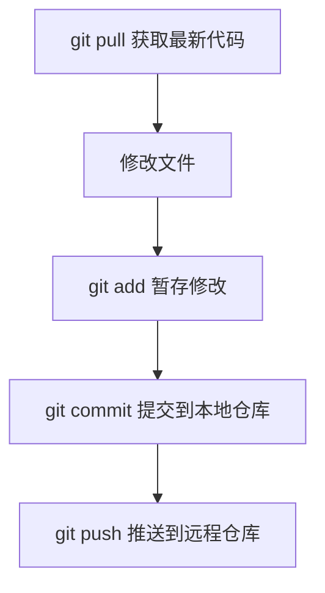

## 前言

Git 是日常开发里绕不开的工具。写代码时，我们经常需要拉取最新代码、创建分支、提交修改、处理冲突、同步远程分支，偶尔还会遇到改错 commit message、误提交文件、回退代码、cherry-pick 指定提交等场景。

这篇文章把常用 Git 命令整理成一份工作速查手册。重点不是罗列命令，而是把它们放进真实工作流里，知道什么时候该用、用的时候要注意什么。

## Git 工作示意图

先放一张 Git 工作流示意图，帮助理解工作区、暂存区、本地仓库和远程仓库之间的关系。


再看一张 Git 命令图示例，可以把常用命令和对应区域串起来。


一般来说，日常开发的基本路径是：



## 一套最常见的开发流程

下面是一套很典型的工作流程：

```bash title="daily-workflow.sh"
git pull
vi README.md
git add README.md
git commit -m "cc-data-dp-{id} update readme info"
git push origin HEAD:refs/for/master
```

如果需要推到 topic 分支，可以使用类似命令：

```bash title="push-topic.sh"
git push origin HEAD:refs/for/topic/proactive_service
```

这里的提交信息里包含 `cc-data-dp-{id}`，通常是为了绑定需求卡片、任务卡片或者内部系统里的工作项。实际开发时，提交信息最好能说明“为什么改”和“改了什么”，不要只写 `update`、`fix` 这种过于笼统的内容。

## 常用别名配置

Git 命令有些比较长，可以配置别名提高效率。

```bash title="git-alias.sh"
git config --global alias.st status
git config --global alias.ci commit
git config --global alias.df diff
git config --global alias.co checkout
git config --global alias.br branch
```

配置之后就可以这样使用：

```bash title="alias-usage.sh"
git st
git df
git ci -m "feat: update docs"
git br -a
```

> [!TIP] 建议
> 别名适合提升个人效率，但团队文档里最好仍然写完整命令，避免别人看不懂。

## Git 常用命令速查

### 基础命令

| 命令 | 作用 | 示例 |
| :--- | :--- | :--- |
| `git clone` | 克隆远程仓库到本地 | `git clone xxx.git` |
| `git init` | 初始化一个 Git 仓库 | `git init` |
| `git status` | 查看工作区状态 | `git status` |
| `git add` | 把修改加入暂存区 | `git add README.md` |
| `git commit` | 提交暂存区内容到本地仓库 | `git commit -m "message"` |
| `git log` | 查看提交历史 | `git log --oneline --graph` |
| `git diff` | 查看差异 | `git diff` |

### 远程相关

| 命令 | 作用 | 示例 |
| :--- | :--- | :--- |
| `git remote` | 查看或管理远程仓库 | `git remote -v` |
| `git fetch` | 拉取远程更新，但不自动合并 | `git fetch origin` |
| `git pull` | 拉取并合并远程更新 | `git pull` |
| `git push` | 推送本地提交到远程 | `git push origin master` |

`git pull` 可以理解为 `git fetch + git merge`。如果只想先拿到远程变化，但暂时不合并到当前工作区，应该使用 `git fetch`。

### 暂存与恢复

`git stash` 用来临时保存当前不想提交的修改。

```bash title="stash.sh"
git stash save "work in progress"
git stash list
git stash pop stash@{0}
```

常见场景是：你正在开发一个需求，突然需要切分支修 bug，但当前改动还没到能提交的程度。这时可以先 `stash`，切过去处理完再恢复。

## 分支管理

### 创建和切换分支

```bash title="branch-create.sh"
# 创建分支
git branch <branch-name>

# 切换分支
git checkout <branch-name>
git switch <branch-name>

# 创建并切换
git checkout -b <branch-name>
git switch -c <branch-name>
```

`git switch` 是 Git 2.23+ 提供的新命令，语义更清晰；老项目里 `checkout` 仍然很常见。

### 删除分支

```bash title="branch-delete.sh"
# 安全删除本地分支
git branch -d <branch-name>

# 强制删除本地分支
git branch -D <branch-name>

# 删除远程分支
git push origin --delete <branch-name>
```

> [!WARNING] 注意
> `git branch -D` 会强制删除本地分支，即使分支上还有未合并提交。使用前先确认这些提交不再需要。

### 重命名分支

```bash title="branch-rename.sh"
git branch -m <new-name>
```

也可以用“创建新分支 + 删除旧分支”的方式处理：

```bash title="branch-rename-old-way.sh"
git checkout -b <new-name>
git branch -d <old-name>
```

## 提交与撤销

### 提交修改

```bash title="commit.sh"
git add <file>
git add .
git commit -m "message"
```

删除文件时可以使用：

```bash title="remove-file.sh"
git rm <file>
git rm -rf <folder>
```

如果只是误把文件加入暂存区，但不想提交，可以取消暂存：

```bash title="unstage.sh"
git restore --staged <file>
```

### 修改最近一次提交信息

```bash title="amend-message.sh"
git commit --amend
```

这个命令会修改最近一次提交。如果这次提交已经推送到远程，再修改就会涉及历史变更，后续 push 可能需要额外处理。

### 撤销本地修改

```bash title="restore-file.sh"
git restore <file>
```

老写法也常见：

```bash title="checkout-file.sh"
git checkout -- <file>
```

> [!CAUTION] 谨慎
> 撤销本地修改会丢弃未提交内容。执行前一定确认这些改动不再需要。

### 回退提交

```bash title="reset.sh"
# 回退最近一次提交，但保留修改
git reset --soft HEAD~1

# 强制回退并丢弃修改
git reset --hard HEAD~1
```

`--soft` 会保留改动，适合“提交早了，想重新整理再提交”。

`--hard` 会丢弃改动，风险很高。除非非常确定，否则不要轻易使用。

## 远程仓库操作

### 拉取与推送

```bash title="remote-sync.sh"
git pull
git fetch origin
git push origin <branch-name>
```

如果需要把本地分支关联到远程分支：

```bash title="set-upstream.sh"
git push --set-upstream origin <local-branch>:<remote-branch>
```

### Gerrit 风格推送

有些团队使用 Gerrit 或类似代码评审系统，推送方式不是直接推到分支，而是推到 `refs/for/...`。

```bash title="gerrit-push.sh"
git push origin HEAD:refs/for/master
git push origin HEAD:refs/for/topic/proactive_service
```

这种方式的含义通常是：把当前 HEAD 提交推到目标分支的评审队列里，而不是直接合入目标分支。

## SSH 与网络环境检查

测试 SSH 连接：

```bash title="ssh-test.sh"
ssh -T
```

查看 SSH 公钥：

```bash title="public-key.sh"
cat ~/.ssh/id_rsa.test.pub
```

如果公司网络需要代理，可以按内部环境启用代理，例如：

```bash title="proxy.sh"
proxyon
```

> [!IMPORTANT] 重要
> 不要把私钥、Token、Cookie、`.git/credentials` 等敏感信息提交到仓库。

## 凭证配置

某些环境会配置私有凭证文件：

```bash title="credential-helper.sh"
git config credential.helper 'store --file=.git/credentials'
```

这类配置适合本机使用，但 `.git/credentials` 里可能包含敏感认证信息，不应该提交到远程仓库。

## 合并、变基与冲突处理

### merge

```bash title="merge.sh"
git merge <branch>
```

`merge` 会把指定分支合并到当前分支，通常会保留分支合并历史。

### rebase

```bash title="rebase.sh"
git fetch origin
git checkout develop
git rebase origin/develop
```

`rebase` 会把你的本地提交“搬到”远程最新提交之后，让提交历史更线性。

如果发生冲突：

```bash title="rebase-conflict.sh"
git status

# 修改冲突文件后
git add path/to/file
git rebase --continue
```

如果某个文件想直接采用远程版本：

```bash title="use-theirs.sh"
git checkout --theirs path/to/file
git add path/to/file
```

如果想直接采用本地版本：

```bash title="use-ours.sh"
git checkout --ours path/to/file
git add path/to/file
```

> [!WARNING] rebase 提醒
> `rebase` 会改写提交历史。如果相关提交已经推到远程并被别人基于它继续开发，使用前一定要谨慎。

### 冲突处理基本流程

最常见的冲突处理思路：

1. 先用 `git status` 看冲突文件。
2. 打开文件，处理 `<<<<<<<`、`=======`、`>>>>>>>` 冲突标记。
3. 决定保留本地、远程，或者两边合并。
4. `git add` 标记冲突已解决。
5. 继续 `merge` 或 `rebase` 流程。

## cherry-pick

`git cherry-pick` 可以把某一个提交单独摘到当前分支。

```bash title="cherry-pick.sh"
git cherry-pick <commit-id>
```

适合场景：

- 某个修复需要同步到另一个分支；
- 不想合并整个分支，只想拿其中一个 commit；
- 发布分支需要临时补一个 bugfix。

如果 cherry-pick 发生冲突，处理方式和 rebase 类似：解决冲突后执行：

```bash title="cherry-pick-continue.sh"
git add path/to/file
git cherry-pick --continue
```

## diff-cover：只看改动行覆盖率

有时我们不只关心整体覆盖率，而是想看“本次提交改动行”的覆盖率。可以使用 `diff-cover`。

### 生成 coverage.xml

```bash title="coverage.sh"
python -m coverage erase
python -m coverage run --rcfile scripts/.coveragerc -m pytest -c tests/cov_pytest.ini -q
python -m coverage combine
python -m coverage xml -o coverage.xml
```

### 查看指定文件的改动行覆盖率

```bash title="diff-cover.sh"
diff-cover coverage.xml \
  --compare-branch HEAD^ \
  --include 'fastdeploy/engine/common_engine.py'
```

如果想生成 HTML 报告：

```bash title="diff-cover-html.sh"
diff-cover coverage.xml \
  --compare-branch HEAD^ \
  --include 'fastdeploy/engine/common_engine.py' \
  --html-report diff_coverage.html
```

也可以把基线从 `HEAD^` 换成远程分支：

```bash title="diff-cover-origin.sh"
diff-cover coverage.xml --compare-branch origin/develop
```

## 常见问题处理

### 误添加文件

如果只是误加入 Git 跟踪，可以取消追踪但保留本地文件：

```bash title="rm-cached.sh"
git rm --cached <file>
```

### 想保留本地提交并同步远程最新

推荐流程：

```bash title="sync-with-rebase.sh"
git status
git fetch origin
git checkout develop
git rebase origin/develop
```

如果本地提交之前没有推过，rebase 完成后正常 push：

```bash title="push-normal.sh"
git push origin develop
```

如果本地提交已经推过，并且你确认需要改写远程历史：

```bash title="force-with-lease.sh"
git push --force-with-lease origin develop
```

> [!CAUTION] 强推提醒
> `--force-with-lease` 比 `--force` 安全，但仍然属于改写远程历史。多人协作分支上使用前一定要确认影响范围。

### 强制同步远程分支

如果你明确想让本地完全回到远程状态：

```bash title="reset-to-origin.sh"
git fetch origin
git reset --hard origin/master
```

> [!CAUTION] 高风险命令
> `git reset --hard origin/master` 会丢弃本地未提交修改和本地提交。执行前请确认这些内容不再需要。

## 总结

Git 命令很多，但日常工作可以先记住几条主线：

1. 开发流程：`pull → 修改 → add → commit → push`
2. 分支流程：`branch/switch/checkout → merge/rebase → push`
3. 临时保存：`stash save → stash pop`
4. 问题修复：`restore`、`reset --soft`、`revert`、`cherry-pick`
5. 高风险操作：`reset --hard`、`rebase`、`force-with-lease`，执行前一定要确认影响范围。

真正熟练使用 Git，不是记住所有命令，而是知道每个命令会影响哪个区域：工作区、暂存区、本地仓库，还是远程仓库。只要这个关系理清楚，很多 Git 问题就不会那么吓人。
